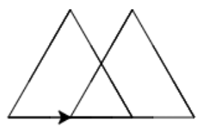

# Les 4

## Even opfrissen

1\)

1.  (4) (1) (1) (1).png>)
2. FOUT. De dubbele punt (:) mist in de eerste regel.
3. FOUT. De indentatie (spaties) missen in de tweede en derde regel.
4. 

2\)

1\.

```python
1. for i in range(3):
2.    pen.left(120)
3.    pen.forward(100)
4. for i in range(4):
5.    pen.left(90)
6.    pen.forward(100)
```

2\.

```python
1. for i in range(4):
2.   pen.left(90)
3.   pen.forward(100)
4. pen.forward(100)
5. for i in range(3):
6.   pen.right(90)
7.   pen.forward(100)
```

## Variabelen in een lus

1\)

1.  (3) (3) (3) (3) (3) (3) (2).png>)
2.  (4) (1) (1).png>)
3.  (1) (2).png>)
4.  (1) (3).png>)
5.  (4) (4) (4) (4) (4) (4) (4) (1) (2).png>)
   1.  (1) (1).png>) 7. De code van opdracht 6 gebruikt de variabele aantal\_hoeken (die een waarde van 8 heeft) om te berekenen hoeveel graden de pen moet draaien voor de hoek van een (in dit geval) achthoek. Dat doe je door 360 graden te delen door het aantal hoeken (hier dus de variabele aantal\_hoeken) 8. \`\`\`python Hallo Hallo Hallo \`\`\` 9. \`\`\`python Hallo 1c Hallo 1c Hallo 1c \`\`\` 10. \`\`\`python Goedemorgen 1c Goedemorgen 1c Goedemorgen 1c \`\`\`

2\)

1.  (3) (3) (3) (3) (3) (3) (1) (2).png>)
2. FOUT, aantal\_hoeken is niet gedefinieerd.
3. 
4. 
5. FOUT, de indentatie van de twee laatste regels code is incorrect. Hier moeten twee spaties voor, bij beide regels.&#x20;
6.  (4) (4) (4) (4) (4) (4) (4) (1).png>)
7. De code van opdracht 6 gebruikt de variabele aantal\_keer in de for-lus om de herhaling dat aantal keren uit te voeren. aantal\_keer heeft hier de waarde 3, dus de for-lus wordt 3 keer uitgevoerd. Ook de waarde van de hoek zit in een variabele. Voor het commando pen.left() wordt hier dus de variabele hoek gebruikt die een waarde van 60 heeft gekregen. Het aantal graden dat de pen draait zal dus 60 zijn.
8. FOUT. Je krijgt hier een foutmelding. Voor het aantal herhalingen van de for-lus wordt de variabele klas gebruikt. De variabele klas heeft als waarde '1c', dus is een string (reeks van karakters) en geen integer (cijfer). Een for-lus heeft als argument een integer nodig en kan niets met een string. De for-lus weet nu niet hoe vaak deze een herhaling moet uitvoeren en geeft wegens het hebben gekregen van een ongeschikt argument een foutmelding.

3\)

1.  (2) (2) (2) (2) (2) (2) (2) (1) (1).png>)
2.  (2) (2) (2) (2) (2) (2) (1).png>)
3. 
4. 
