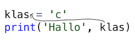

# Les 2a

## Variabelen

Aan het einde van de les kun jij:

* 'commentaar' schrijven en herkennen
* tekst opslaan in een variabele
* een variabele gebruiken om een tekst meerdere keren te printen
* voorspellen wat een code doet met een variabele erin
* goede en foute `print()`-codes vinden met een variabele erin

### Even opfrissen!

Vorige week hebben we de `print()` opdracht gezien.

Een `print()` opdracht print een woord uit, als het tussen aanhalingstekens staat. Bijvoorbeeld zo:

```python
print('Goedemorgen')
```

Je kunt ook meerdere woorden printen, bijvoorbeeld:

```python
print('Goedemorgen', 'leerlingen', 'uit', 'deze', 'klas)
```

1\) Welke van deze `print()` opdrachten print **Goedemorgen** uit?

Schrijf de goede code over in je schrift!

Tip: **Let goed op de aanhalingstekens!**

```python
1. print Goedemorgen

2. print('Goedemorgen")

3. print(Goedemorgen)

4. print("Goedemorgen')

5. print('Goedemorgen')
```

2\) Welke van deze `print()` opdrachten print **Python is een programmeertaal** uit?

Schrijf de goede code over in je schrift.

Tip: Let goed op, de goede code heeft:

* Ronde haakjes
* Een aanhalingsteken voor en na ieder woord
* Komma's tussen alle woorden

Weet jij welke code goed is?

```python
1. print('Python', 'is', 'een', 'programmeertaal')

2. print('Python', is, een, 'programmeertaal')

3. print('Python', 'is', 'een' 'programmeertaal')

4. print Python is een programmeertaal

5. print(Python is een programmeertaal)
```

3\) Kies nu zelf een kort zinnetje om te printen. Bijvoorbeeld: 'Is het al pauze?'.

Schrijf de code voor het zinnetje in je schrift.


4\) Wat is de fout?

Al deze codes zouden **Hallo allemaal** moeten printen maar dat doen ze niet. Wat gaat er mis?

Schrijf in je schrift wat de fout is.

```python
1. prnt('Hallo', 'allemaal')
```

```python
2. print('Hallo') print('allemaal')
```

```python
3. print('Hallo' , allemaal')
```

```python
4. print('Hallo' 'allemaal')
```

```python
5. print 'Hallo allemaal'
```

```python
6. prit('Hallo')
   prit('allemaal')
```

Einde werkblad! Ben je klaar, leg dan je schrift bovenaan op je tafel

### Commentaar

Je kunt Python ook codes laten overslaan met een hekje. Een hekje ziet er zo uit: \#. Het hekje staat boven de 3 op je toetsenbord. Iedere regel die achter een hekje staat, wordt overgeslagen.

1\) Er zijn drie redenen waarom je commentaar gebruikt in een programma. Schrijf die redenen in je schrift.

2\) Hier staan drie codes en drie resultaten: de woorden die in beeld komen.

Welke code hoort bij welk resultaat?

Schrijf de codes over in je schrift, met het resultaat erachter. Bijvoorbeeld: print\('test'\) &gt; test

**Let op:** een van de drie codes geeft een fout.

Codes:

```python
print('Hallo')                            
#print('Hallo')                        
print('Hallo')
```

```python
#Hallo
print('Hallo')
```

```python
print(#Hallo)
```

Resultaten:

* Hallo
* Hallo

  Hallo

* Deze code geeft een fout.

3\) Hieronder staan vier codes met commentaar erin. Wat printen deze codes uit?

Schrijf de uitvoer in je schrift.

```python
print('Goedemorgen')               
#print('leerlingen')
```

```python
#goedemorgen, dit is een Pythonprogramma

print('Hallo', 'kinderen!')
```

```python
print('Hallo', 'kinderen!') #je kunt twee woorden printen
print('Dit', 'is', 'Python!') #maar ook drie
```

```python
print('Hallo')               
print('leerlingen', 'uit', 'deze', 'klas')
```

Einde werkblad! Ben je klaar, leg dan je schrift bovenaan op je tafel


### Waardes zoeken

1\) In Python kun je woorden zonder aanhalingstekens gebruiken. Dat zijn variabeles. Als Python een variabele tegenkomt gaat hij omhoog zoeken in het programma naar de _definitie_ van de variabele. Dat betekent waar de variabele wordt ingesteld met een is-teken:

```python
naam = 'Felienne'
```

Schrijf deze codes over. Zet een pijltje tussen het gebruik van een variabele en zijn definitie.



```python
1. les = 'Coderen'
   print('Welkom', 'bij', les)
```

```python
2. doelgroep = 'leerlingen'
   print('Hallo', doelgroep)
```

```python
3. les = 'Coderen'
   doelgroep = 'leerlingen'
   print('Hallo' , doelgroep, 'dit', 'is', les)
```

2\) Hieronder staan codes met een variabele erin. Wat print Python uit als we deze codes uitvoeren?

Schrijf de uitvoer in je schrift.

```python
1. print('Hallo', 'allemaal')
```

```python
2. doelgroep = 'leerlingen'
   print('Hallo', doelgroep)
```

```python
3. print('Hallo', )
```

```python
4. les = 'coderen'
   print('Hallo' 'leerlingen', 'bij', les)
```

Einde werkblad! Ben je klaar, leg dan je schrift bovenaan op je tafel.

### Naam niet gedefinieerd

Is de code goed of fout? Kijk goed of de variabele die gebruikt wordt wel gedefinieerd is.

* Als de code fout is, schijf je Fout
* Als de code goed is, schrijf je op wat er geprint wordt.

Voorbeeld 1\)

```python
naam = 'Felienne'
print(voornaam)
```

Deze code is fout, want `voornaam` bestaat niet. Dan schrijf je:

Fout

Voorbeeld 2\)

```python
doelgroep = 'leerlingen'
print('Hallo', doelgroep)
```

Deze code is goed, doelgroep is nu 'leerlingen'. Dan schrijf je:

Hallo leerlingen

Nu jij!

```python
1. doelgroep = 'leerlingen'
   print('Hallo', naam)
```

```python
2. doelgroep = 'leerlingen'
   print('Hallo', 'leerlingen')
```

```python
3. achternaam = 'Hermans'
   print('Hallo', 'mevrouw', Hermans)
```

```python
4. tijd_op_klok = 'half 9'
   print('Het', 'is', tijd_op_klok)
```

```python
5. les = 'coderen'
   print('Hallo', 'leerlingen', 'van', les)
```

```python
6. print(Goedemorgen)

```

```python
7. tijd = 'half 9'
   print('Het', 'is', 'tijd')
```
