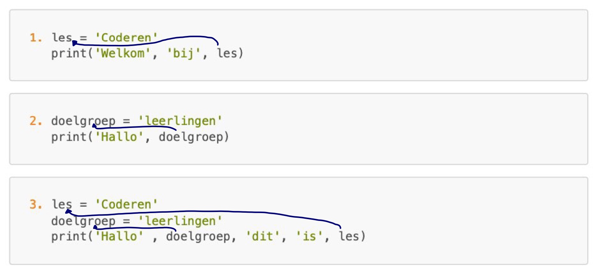

# Les 2a nakijkmodel

## Even opfrissen!

1\) Optie nummer 5 print `Goedemorgen` uit. Hieronder wordt uitgelegd wat fout is aan de andere regels.

1. Mist de ronde haakjes open en sluit en mist de aanhalingstekens om het woord.
2. Er wordt een combinatie gemaakt van een enkele en een dubbele aanhalingsteken. 
3. De enkele aanhalingstekens om het woord Goedemorgen zijn vergeten
4. Er wordt een combinatie gemaakt van een enkele en een dubbele aanhalingsteken. 

2\) Optie 1 print `Python is een programeertaal` uit. Hieronder wordt uitgelegd wat fout is aan de andere regels.

2. De aanhalingstekens om `is` en `een` missen. 
3. Er mist een komma tussen `'een'` en `'programmeertaal'`
4. De ronde haakjes open en sluit missen, alle aanhalingstekens om alle woorden en de komma tussen al deze woorden met aanhalingstekens missen.
5. Alle aanhalingstekens om alle woorden de komma tussen al deze woorden met aanhalingstekens missen.

3\)

   ```python
   print('Is', 'het', 'al', 'pauze?')
   ```

4\) 

1. `prnt` is fout geschreven, moet `print` zijn (de i mist).
2. De tweede `print('Allemaal')` staat in de eerste regel code, dit zal een foutmelding veroorzaken. Deze code moet naar de volgende regel
3. Er mist een aanhalingsteken voor `allemaal')` .
4. De komma tussen `'Hallo'` en `'allemaal'` mist. Dit geeft geen foutmelding, maar de code print 'Halloallemaal', dus zonder spatie.
5. De ronde haakjes missen. Rond haakje open na `print` en rond haakje sluit na `allemaal'`
6. `prit` is fout geschreven, moet `print` zijn (de n mist).

## Commentaar! 

1\) Je gebruikt commentaar om:
- Bovenaan te schrijven wat een programma doet
- Uitleg bij een stukje code te geven 
- Een regel code eventjes 'uit' te zetten

2\) 
```python
print('Hallo')                            
# print('Hallo')                        
print('Hallo')  
```

`Hallo`
`Hallo`

De middelste regel wordt niet uitgeprint. Dit is commentaar en python slaat commentaar over.

```python
# Hallo
print('Hallo')
```

`Hallo`

De eerste regel wordt niet uitgeprint. Dit is commentaar en python slaat commentaar over.
 
```python
print(#Hallo)   
```

Deze code geeft een fout. Er wordt een comment geschreven in de functie print(). Dit kan niet. Als je hier commentaar achter had willen schrijven, dan had je 
`print('Hallo') #Hallo` moeten doen. 

3\) 

1. `Goedemorgen`  
   De onderste regel wordt niet uitgeprint. Dit is commentaar en Python slaat commentaar over.

2. `Hallo kinderen!`  
   De bovenste regel wordt niet uitgeprint. Dit is commentaar en Python slaat commentaar over.
   
3. `Hallo kinderen!`  
   `Dit is Python!`    
   De tekst in de `print()` wordt uitgeprint maar de tekst erachter niet. Dit is commentaar en Python slaat commentaar over.

4. `Hallo`  
   `leerlingen uit deze klas`  
   Alle tekst wordt uitgeprint. Er is geen commentaar in dit stukje code. 

## Waardes zoeken

1\) Er moet een streep getrokken zijn tussen de variabele definitie en het gebruik van de variabele zoals hieronder te zien is.

  

2\)

1. `Hallo allemaal` 

2. `Hallo leerlingen`
   
3. `Hallo ` 
Let op: door de komma na 'Hallo' wordt er een spatie aan de print toegevoegd. Het is netter om de komma weg te laten, maar het is niet fout.

4. `Halloleerlingen bij coderen`  
Let op: doordat de komma is vergeten tussen 'Hallo' en 'leerlingen' komt er geen spatie tussen de twee woorden. Python geeft geen foutmelding, maar doet hierdoor niet precies wat wij willen.

## Naam niet gedefinieerd

1. **Fout**  
   De gebruikte variabele `naam` is niet gedefinieerd, en de gedefinieerde variabele `doelgroep` wordt niet gebruikt. Onderstaand is de goede manier:

   ```python
   doelgroep = 'leerlingen'
   print('Hallo', doelgroep)
   ```

   of

   ```python
   naam = 'Felienne'
   print('Hallo', naam)
   ```

2. `Hallo leerlingen`  
Code zal geen foutmelding geven, maar in plaats van `'leerlingen'` moet er in de print gebruik gemaakt worden van de gedefinieerde variabele `doelgroep` die als waarde `'leerlingen'` heeft gekregen. Onderstaand is de goede manier:

  ```python
  doelgroep = 'leerlingen'
  print('Hallo', doelgroep)
  ```
  
3. **Fout**  
   De gebruikte variabele `Hermans` is niet gedefinieerd, en de gedefinieerde variabele `achternaam` wordt niet gebruikt. Let op: Hermans was als gedefinieerde variabele een foutieve variabele geweest, een variabelenaam begin je in python met een kleine letter. Onderstaand is de goede manier:

   ```python
   achternaam = 'Hermans'
   print('Hallo', 'mevrouw', achternaam)
   ```

4. `Het is half 9`

   Hier is correct gebruik gemaakt van de variabele `tijd_op_klok` die als waarde `'half 9'` heeft gekregen.

5. `Hallo leerlingen van coderen`

   Hier is correct gebruik gemaakt van de variabele `les` die als waarde `'coderen'` heeft gekregen.


6. **Fout**  
   De gebruikte variabele `Goedemorgen` is niet gedefinieerd. In plaats van `Goedemorgen` moet er in de print gebruik gemaakt worden van een gedefinieerde variabele `goedemorgen` die als waarde `'Goedemorgen'` krijgt.
   Let op: Goedemorgen was als gedefinieerde variabele een foutieve variabele geweest, een variabelenaam begin je in python met een kleine letter. 
   
   Onderstaand is de goede manier:

   ```python
   goedemorgen = 'Goedemorgen'
   print(goedemorgen)
   ```

7. `Het is tijd`

  De code zal geen foutmelding geven, maar in plaats van `'tijd'` moet er in de print gebruik gemaakt worden van de gedefinieerde variabele `tijd` . Onderstaand is de goede manier:

  ```python
  tijd = 'half 9'
  print('Het', 'is', tijd)
  ```