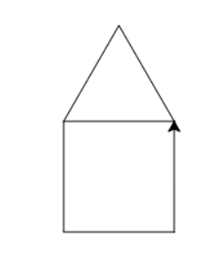

# Les 1b

#### Opdracht 2b-1\) Teken een vierkant

Deze les wordt afgetekend als:

* Je een vierkant hebt getekend met Python

**Opdracht.** Blader terug naar de tekening van het vierkant in je schrift. Gebruik de **acht** codes die je daar hebt opgeschreven om een vierkant te tekenen.

#### Opdracht 2b-2\) Teken een driehoek

Deze les wordt afgetekend als:

* Je een driehoek hebt getekend met Python

**Opdracht.** Blader terug naar de tekening van de driehoek in je schrift. Gebruik de **zes** codes die je daar hebt opgeschreven om een vierkant te tekenen.

#### Opdracht 2b-3\) Teken een zeshoek

Deze les wordt afgetekend als:

* Je de som voor een zeshoek in je schrift hebt geschreven
* Je een zeshoek hebt getekend met Python

**Opdracht.** Welke som moet je berekenen als je een zeshoek wilt tekenen? Schrijf de som in je schrift.

Ben je met deze opdrachten klaar? Hang dan je gele post-it op.

Je mag ondertussen wel doorwerken aan de rest van de opdrachten.

**Opdracht 2b-4\) Teken een schilderij \(extra\)**

Deze les wordt afgetekend als:

* Je de de tekening met de hand getekend hebt
* Je de juiste Python codes op papier invult
* Je het goede plaatje hebt getekend met Python

Dit is een schilderij van een berg \(met een beetje fantasie!\)

**Opdracht.** Teken dit plaatje met de hand over in je schrift. Zorg dat je pen op het papier blijft. Zet nu de juiste Pythoncodes bij de juiste plekken. Bij de lijntjes én bij de hoeken!

#### Opdracht 2b-5\) Maak een huisje \(extra\)

Deze les wordt afgetekend als:

* Je het huisje hieronder hebt getekend.

**Opdracht.** Probeer dit huisje na te maken.

#### Opdracht 2b-6\) Maak een diamant \(extra\)

Deze les wordt afgetekend als:

* Je de diamant hieronder hebt getekend.

Opdracht. Probeer dit na te maken.

#### Opdracht 2b-7\) Maak je tekening mooier \(extra\)

Deze les wordt afgetekend als:

* Je minstens één extra figuur in het schilderij hebt toegevoegd.

**Opdracht.** Voeg iets leuks toe aan je schilderij. Een sterretje, een zonnetje of een poppetje? Maak er maar iets leuks van!

Tip: van het ene naar het andere figuur wil je soms even de pen van het papier halen. Dat kan met `pen.penup()` en `pen.pendown()`.

