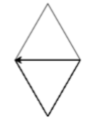

# Les 2b

## 1\) Maak een zeshoek met een for-lus

Deze opdracht wordt afgetekend als:

* Je een zeshoek hebt getekend met Python
* Je daarvoor een forlus hebt gebruikt

Vorige week heb je een zeshoek getekend. Dat ging zo:

```python
pen.forward(100)
pen.left(60)
pen.forward(100)
pen.left(60)
pen.forward(100)
pen.left(60)
pen.forward(100)
pen.left(60)
pen.forward(100)
pen.left(60)
pen.forward(100)
pen.left(60)
```

**Opdracht.** Teken een zeshoek met een for-lus.

Denk aan deze tips:

* Vergeet de dubbele punt : niet aan het einde van de regel
* Regels in de lus moeten beginnen met 2 spaties!
* Als je het goed doet, heb je maar 3 regels nodig voor de zeshoek 
* De regels die we al hadden staan tellen daarvoor niet mee \(import, en pen= en pen.speed\)

## 2\) Maak een vierkant met een for-lus

Deze opdracht wordt afgetekend als:

* Je weet welke regels we moeten veranderen om een vierkant te maken.
* Je een vierkant hebt getekend met Python
* Je daarvoor een forlus hebt gebruikt

In de vorige opdracht heb je een zeshoek getekend met een for-lus Dat ging zo:

```python
for i in range(6):
    pen.forward(100)
    pen.left(60)
```

**Opdracht.** Als je nu een vierkant wilt maken, moet je de getallen 6 en 60 veranderen. Waarin? Schrijf het op in je schrift:

* 6 wordt ....
* 60 wordt ...

**Opdracht.** Teken nu het vierkant met een for-lus

Tip: Je hoeft niets anders te veranderen, alleen de getallen.

## 3\) Maak een spirograaffiguur met een for-lus

Deze opdracht wordt afgetekend als:

* Je een spirograafachtig figuur maakt met Python
* Je daarvoor een forlus hebt gebruikt

In de vorige opdracht heb je een vierkant getekend met een for-lus. Nu willen we een soort sterfiguur. Weet je nog van vorige week wat voor hoek je dan moet gebruiken? En hoevaak dnek je dat je rond moet gaan? Probeer dit figuur zo precies mogelijk na te maken


**Opdracht.** Teken nu het figuur met een for-lus

## 4\) Teken een schilderij met twee for-lussen

Deze opdracht wordt afgetekend als:

* Je het goede plaatje hebt getekend met Python
* Je daarvoor twee for-lussen gebruikt

Dit is een schilderij van een berg \(met een beetje fantasie!\). Kun jij het namaken met Python? Je moet wel twee lussen gebruiken!


## Extra\) Maak een huisje met twee for-lussen

Deze opdracht wordt afgetekend als:

* Je het huisje hieronder hebt getekend
* Je daarvoor twee for-lussen gebruikt

**Opdracht.** Probeer dit huisje na te maken.


## Extra\) Maak een diamant met twee for-lussen \(extra\)

Deze opdracht wordt afgetekend als:

* Je de diamant hieronder hebt getekend.
* Je daarvoor twee for-lussen gebruikt

Opdracht. Probeer dit na te maken.



## Extra\) Maak iets leuks

Deze opdracht wordt afgetekend als je zelf iets leuks hebt getekend!

