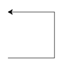
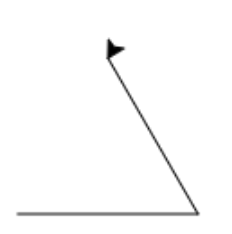

# Les 1a nakijkmodel

## Tekenen en code

1\) 
```python
1. pen.forward(100)
2. pen.left(90)
3. pen.forward(100)
4. pen.left(90)
5. pen.forward(100)
6. pen.left(90)
7. pen.forward(100)
8. pen.left(90)
```

2\)
1. Onze pen kan een heel rondje draaien, wat 360 graden is. We willen dat hij maar 1/3e rondje draait, want er zijn 3 hoeken en bij alle hoeken bij elkaar willen we het hele rondje gedraaid hebben. Dus draaien we per hoek 360/3 = 120 graden.

2. 
```python
1. pen.forward(100)
2. pen.left(120)
3. pen.forward(100)
4. pen.left(120)
5. pen.forward(100)
6. pen.left(120)
```

3\)
zeshoek: 360/6 = 120 graden

tienhoek: 360/10 = 36 graden

zesendertighoek: 360/36 = 10 graden

dertighoek: 360/ 30 = 12 graden

### Nog meer figuren

1\)
Hier komt een spirograaf uit, met een hoek van 65 graden en 11 herhalingen krijg je bijvoorbeeld onderstaand:


2\)

1. 

2. 

3. 

3\) 

1. 

```python
1. pen.forward(100)
2. pen.left(120)
3. pen.forward(100)
4. pen.left(120)
5. pen.forward(100)
6. pen.left(120)
```

2.

```python
1. pen.forward(100)
2. pen.left(60)
3. pen.forward(100)
4. pen.left(60)
5. pen.forward(100)
6. pen.left(60)
7. pen.forward(100)
8. pen.left(60)
9. pen.forward(100)
10. pen.left(60)
11. pen.forward(100)
12. pen.left(60)
```

3.
```python
1. pen.forward(100)
2. pen.left(36)
3. pen.forward(100)
4. pen.left(36)
5. pen.forward(100)
6. pen.left(36)
7. pen.forward(100)
8. pen.left(36)
9. pen.forward(100)
10. pen.left(36)
11. pen.forward(100)
12. pen.left(36)
13. pen.forward(100)
14. pen.left(36)
15. pen.forward(100)
16. pen.left(36)
17. pen.forward(100)
18. pen.left(36)
19. pen.forward(100)
20. pen.left(36)
```

<div style="page-break-after: always;"></div>

### **Extraatje**

Tekeningen die horen bij code:

1. 

2. 

3. 

Code die hoort bij tekeningen:

1.
```python
1. pen.forward(100)
2. pen.right(120)
3. pen.forward(100)
4. pen.right(120)
5. pen.forward(100)
```
2.
```python
1. pen.left(120)
2. pen.forward(100)
3. pen.left(120)
4. pen.forward(100)
5. pen.left(120)
6. pen.forward(100)
7. pen.left(90)
8. pen.forward(100)
9. pen.left(90)
10. pen.forward(100)
11. pen.left(90)
12. pen.forward(100)
13. pen.left(90)
14. pen.forward(100)
```
3.
```python
1. pen.forward(100)
2. pen.left(60)
3. pen.forward(100)
4. pen.left(60)
5. pen.forward(100)
6. pen.left(60)
7. pen.forward(100)
8. pen.left(60)
9. pen.forward(100)
10. pen.left(60)
11. pen.forward(100)
12. pen.left(150)
13. pen.forward(175)
14. pen.right(90)
15. pen.forward(100)
16. pen.right(90)
17. pen.forward(175)
```


