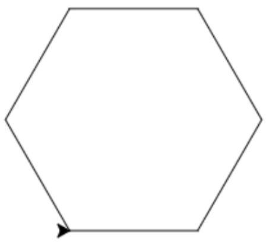

# Les 2

## Even opfrissen!

1\)

```python
1. pen.forward(100)
2. pen.left(90)
3. pen.forward(100)
4. pen.left(90)
5. pen.forward(100)
6. pen.left(90)
7. pen.forward(100)
8. pen.left(90)
```

2\) Onze pen kan een heel rondje draaien, wat 360 graden is. We willen dat hij maar 1/3e rondje draait, want er zijn 3 hoeken en bij alle hoeken bij elkaar willen we het hele rondje gedraaid hebben. Dus draaien we per hoek 360/3 = 120 graden.

```python
1. pen.forward(100)
2. pen.left(120)
3. pen.forward(100)
4. pen.left(120)
5. pen.forward(100)
6. pen.left(120)
```

3\) 1. zeshoek

1. 360/5 = 72 graden
2. achthoek
3. 360/100 = 3,6 graden

4\) 1.

```python
1. pen.forward(100)
2. pen.left(120)
3. pen.forward(100)
4. pen.left(120)
5. pen.forward(100)
6. pen.left(120)
```

2.

```python
1. pen.forward(100)
2. pen.left(60)
3. pen.forward(100)
4. pen.left(60)
5. pen.forward(100)
6. pen.left(60)
7. pen.forward(100)
8. pen.left(60)
9. pen.forward(100)
10. pen.left(60)
11. pen.forward(100)
12. pen.left(60)
```

3.

```python
1. pen.forward(100)
2. pen.left(45)
3. pen.forward(100)
4. pen.left(45)
5. pen.forward(100)
6. pen.left(45)
7. pen.forward(100)
8. pen.left(45)
9. pen.forward(100)
10. pen.left(45)
11. pen.forward(100)
12. pen.left(45)
13. pen.forward(100)
14. pen.left(45)
15. pen.forward(100)
16. pen.left(45)
```

\#\#\# Herhalen met lussen 1\\) 1.  2.  3.  4.  5. 

2\)

1. ```python
   for i in range(4):
   pen.forward(100)
   pen.left(90)
   ```
2. ```python
   for i in range(5):
   pen.forward(100)
   pen.left(72)
   ```
3. ```python
   for i in range(8):
   pen.forward(100)
   pen.left(45)
   ```

### Extraatje!

1. ```python
   for i in range(3):
   pen.forward(100)
   pen.left(60)
   ```
2. ```python
   for i in range(4):
   pen.forward(100)
   pen.left(90)
   for i in range(4):
   pen.left(90)
   pen.forward(100)
   ```
3. ```python
   for i in range(3):
   pen.left(120)
   pen.forward(100)
   for i in range(4):
   pen.left(90)
   pen.forward(100)
   ```
4. ```python
   for i in range(3):
   pen.forward(100)
   pen.right(120)
   ```
5. ```python
   for i in range(10):
   pen.forward(100)
   pen.left(80)
   for i in range(3):
   pen.forward(100)
   pen.left(120)
   ```

