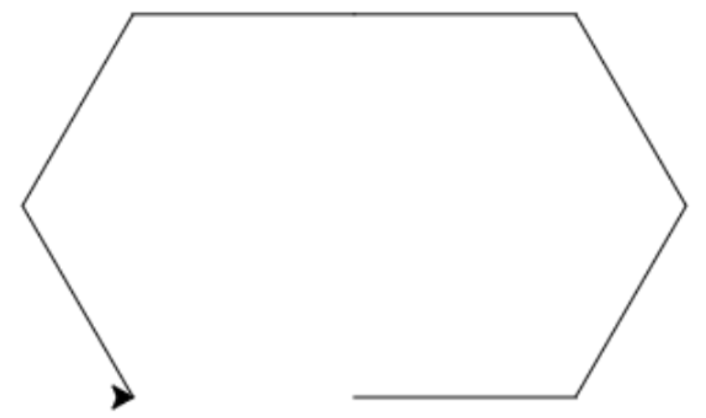
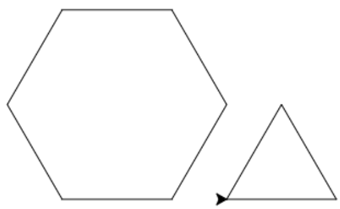

# Les 3

## Even opfrissen!

1\)

1. 
2. Fout: de dubbele punt mist op regel 1.
3. Fout: de indenting \(spaties\) op de tweede en derde regel is fout.
4. 

2\)

1. ```python
   for i in range(3):
   pen.forward(100)
   pen.left(120)
   ```
2. ```python
   for i in range(6):
   pen.forward(100)
   pen.left(60)
   ```
3. ```python
   for i in range(3):
   pen.forward(100)
   pen.left(60)
   ```
4. ```python
   for i in range(8):
   pen.forward(100)
   pen.left(45)
   ```

   \#\#\# Meerdere figuren 1\\) 1.  2.  3.  4.  5.  6.  \#\#\# Extraatje! 1. \`\`\`python for i in range\(9\): pen.forward\(100\) pen.left\(80\) pen.penup\(\) pen.forward\(150\) pen.pendown\(\) for i in range\(9\): pen.forward\(50\) pen.left\(80\) \`\`\` 2. \`\`\`python for i in range\(4\): pen.forward\(100\) pen.left\(90\) pen.penup\(\) pen.forward\(100\) pen.pendown\(\) for i in range\(4\): pen.forward\(100\) pen.left\(90\) \`\`\`

5. \`\`\`python for i in range\(4\): pen.forward\(100\) pen.left\(90\)

for i in range\(3\): pen.forward\(100\) pen.left\(120\)

pen.forward\(100\)

```text
4. 


```python
for i in range(4):
  pen.left(90)
  pen.forward(100)

pen.forward(100)

for i in range(3):
  pen.right(90)
  pen.forward(100)
```

