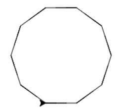

# Les 1a

## Figuren tekenen

Aan het einde van de les kun jij:

* systematisch een vierkant tekenen
* systematisch een driehoek tekenen
* systematisch een spirograaf tekenen
* de bijbehorende Python-code schrijven

**Teken verschillende figuren**

1\) Maak een vierkant

Voor we aan het programmeren gaan, gaan we eerst op papier oefenen. Teken een vierkant in je schrift, maar… doe het precies volgens dit schema!

**Let op:** Begin aan de linkerkant van je blad, anders past het niet. Zorg ook dat er genoeg ruimte naast het figuur is, want je moet er straks Python codes bij zetten.

* Begin in de tekenrichting 'rechts'
* Ga 5 cm in de tekenrichting \(rechts nu dus\)
* Draai 90 graden linksom
* Ga 5 cm volgens de tekenrichting \(dat is nu omhoog\)
* Draai 90 graden linksom
* Ga 5 cm volgens de tekenrichting \(dat is nu links\)
* Draai 90 graden linksom
* Volgens de tekenrichting \(dat is nu omlaag\)
* Draai 90 graden linksom

2\) Maak een driehoek

Teken een driehoek, maar doe het weer volgens dit schema.

* Begin in de tekenrichting 'rechts'
* Ga 5 cm in de tekenrichting \(rechts nu dus\)
* Draai **120** graden linksom 
* Ga 5 cm volgens de tekenrichting \(dat is nu schuin links-omhoog\)
* Draai **120** graden linksom
* Ga 5 cm volgens de tekenrichting \(dat is nu schuin rechts-omlaag\)
* Draai **120** graden linksom

Einde werkblad! Ben je klaar, leg dan je schrift bovenaan op je tafel.

 **Tekenen en code**

1\) Ga terug naar het vierkant dat je hebt getekend in je schrift. Zet deze nummers erbij, op dezelfde plekken.


Nu gaan we Pythoncodes koppelen aan de stukjes van de tekening. Het stukje bij de 1, de rechte lijn, maken we met `pen.forward(100)`Bij 2 draaien we een kwartslag naar links, dus daar hoort `pen.left(90)`. Maak jij de codes af?

Je moet beide opdrachten vier keer gebruiken. Schrijf de codes op volgorde op in je schrift.

1. pen.forward\(100\) 
2. pen.left\(90\) 
3. ...
4. ...
5. ...
6. ...
7. ...
8. ...

 

2\) Doe nu hetzelfde voor de driehoek. Ga terug naar de driehoek die je hebt getekend in je schrift en zet deze nummers erbij.


Nu moeten we even rekenen! 

1. Welke som reken je uit om een driehoek te maken? Schrijf de som in je schrift.
2. Welke Pythoncode gebruik jij voor de hoek van een driehoek? Vul het in op de puntjes.

`pen.left(……)`

Zet jij nu deze opdrachten bij de juiste plekken in de tekening? Je moet allebei de Python opdrachten nu drie keer gebruiken. Schrijf de 6 codes in je schrift:

1. ...
2. ...
3. ...
4. ...
5. ...
6. ...

 3\) Nog wat sommen met hoeken

Reken uit in je schrift:

* Hoeveel moet je draaien voor een zeshoek?
* Hoeveel moet je draaien voor een tienhoek?
* Hoeveel moet je draaien voor een zesendertighoek?
* Hoeveel moet je draaien voor een dertighoek?

Einde werkblad! Ben je klaar, leg dan je schrift bovenaan op je tafel.

 **Nog meer figuren**

1\) Maak een "spirograaf" figuur op papier

Kies nu een eigen getal, waardoor 360 niet mooi deelbaar is. Schrijf je getal in je schrift.

Teken nu het figuur dat bij die hoek hoort.

* Begin in de tekenrichting 'rechts'
* Ga 5 cm in de tekenrichting \(rechts nu dus\)
* Draai **...** graden linksom &lt;— hier komt jouw getal

Doe dit een paar keer, minstens 10!

2\) Hier staan codes, welke figuren maken deze codes? Teken ze in je schrift.

Let op! Het zijn niet altijd complete figuren!

Tip: Als je het niet weet, teken het dan precies na met je geodriehoek.

```python
1.
pen.forward(100)
pen.left(90)
pen.forward(100)
pen.left(90)
pen.forward(100)
```

```python
2.
pen.forward(100)
pen.left(120)
pen.forward(100)
pen.left(120)
```

```python
3.
pen.forward(100)
pen.left(60)
pen.forward(100)
pen.left(60)
pen.forward(100)
pen.left(60)
```

 3\) Nu andersom. Weet jij met welke code je deze figuren tekent? Schijf de codes in je schrift. Tip: reken het na met je geodriehoek.

1. 


2.


3. 



**Extraatje!**

Deze opdrachten zijn **extramoeilijk**! Maak ze alleen als je al klaar bent met de rest van de opdrachten.

Eerst krijg je codes, en dan tekeningen.

```python
1.
pen.forward(100)
pen.left(80)
pen.forward(100)
pen.left(80)
pen.forward(100)
pen.left(80)
pen.forward(100)
pen.left(80)
```

```python
2.
pen.forward(100)
pen.left(180)
pen.forward(100)
pen.left(180)
pen.forward(100)
```

```python
3.
pen.forward(100)
pen.left(120)
pen.forward(100)
pen.left(120)
pen.forward(100)
pen.left(30)
pen.forward(100)
pen.left(90)
pen.forward(100)
pen.left(90)
pen.forward(100)
```

 Schrijf nu weer de codes op die bij deze figuren horen.

1. 


2. 


3. 


