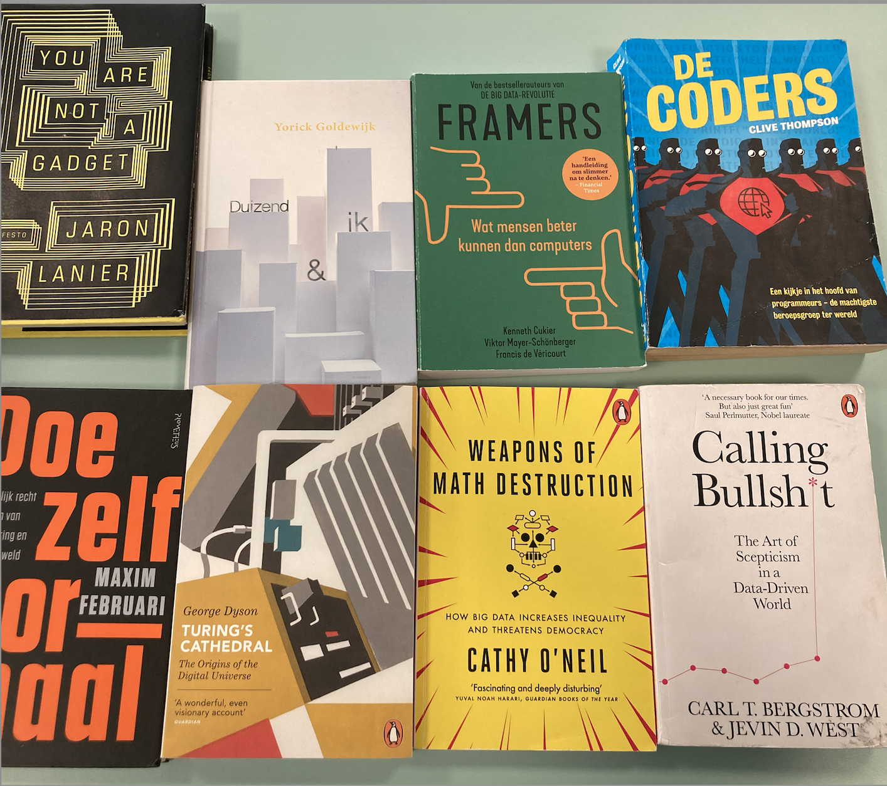

# Les 2a

## Herhalen met Turtle

Aan het einde van de les kun jij:

* For-lussen gebruiken om code te herhalen
* 'Veelvlakken' tekenen met lussen
* Spirograaffiguren tekenen met lussen

### Even opfrissen

Vorige week deden we deze opdracht ook, dat was best een lastige opdracht! 

1\) Teken dit vierkant in je schrift.


Nu gaan we Pythoncodes koppelen aan de stukjes van de tekening. Welke code hoort bij welk stukje?   
Je moet beide opdrachten vier keer gebruiken. Schrijf de codes op volgorde op in je schrift.

1. pen.forward\(100\)
2. pen.left\(90\)
3. ...
4. ...
5. ...
6. ...
7. ...
8. ...

​​2\) Teken deze driehoek in je schrift.


Nu moeten we even rekenen! Welke som reken je uit om een driehoek te maken? Schrijf de som in je schrift.

Een driehoek maak je met:

* pen.left\(……..\) &lt;— dit is het commando voor draaien. Hier komt het getal dat je zojuist hebt berekend
* pen.forward\(100\)

Zet nu deze opdrachten bij de juiste plekken in de tekening. Je moet allebei de Python opdrachten nu drie keer gebruiken. Schrijf de 6 codes in je schrift:

1. ...
2. ...
3. ...
4. ...
5. ...
6. ...

3\) Nog wat sommen met hoeken

Reken uit in je schrift:

* Als je steeds 60 graden draait krijg je een ….hoek?
* Hoeveel moet je draaien voor een vijfhoek?
* Als je steeds 45 graden draait krijg je een ….hoek?
* Hoeveel moet je draaien voor een honderdhoek?

4\) Weet jij met welke code je deze figuren tekent? Schijf de codes in je schrift.

1.


2. 



3. 


Einde werkblad! Ben je klaar, leg dan je schrift bovenaan op je tafel.​​

### Herhalen met lussen

1\) Wat tekenen deze codes?

```text
1.
for i in range(3):
  pen.forward(100)
  pen.left(120)
```

```text
2.
for i in range(6):
  pen.forward(100)
  pen.left(60)
```

```text
3.
for i in range(3):
  pen.forward(100)
  pen.left(90)
```

```text
4.
for i in range(4):
  pen.forward(100)
  pen.left(90)
```

```text
5.
for i in range(4):
  pen.forward(100)
pen.left(90)
```

2\) Hoe teken je deze figuren met een lus?

1.


2. 


3. 


### Extraatjes!

Welke codes horen bij deze tekeningen? Gebruik natuurlijk wel een lus \(of meerdere lussen\).

1.


2.  


3.


4.   


5.


