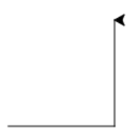

## Module 2: Kunst Les 1 werkblad a nakijkmodel

### Tekenen en code

1) 
```python
1. pen.forward(100)
2. pen.left(90)
3. pen.forward(100)
4. pen.left(90)
5. pen.forward(100)
6. pen.left(90)
7. pen.forward(100)
8. pen.left(90)
```

2)
1. in totaal bestaan er 360 graden. Een driehoek heeft drie hoeken, dat is 360/3, dus een hoek van een driehoek is 120 graden. 
2. 
```python
1. pen.forward(100)
2. pen.left(120)
3. pen.forward(100)
4. pen.left(120)
5. pen.forward(100)
6. pen.left(120)
```

### Nog meer figuren

1)
Hier komt een spirograaf uit, met een hoek van 65 graden en 11 herhalingen krijg je bijvoorbeeld onderstaand:


2)

1. 

2. 

3. 

3) 

1. 

```python
1. pen.forward(100)
2. pen.left(120)
3. pen.forward(100)
4. pen.left(120)
5. pen.forward(100)
6. pen.left(120)
```

2.

```python
1. pen.forward(100)
2. pen.left(60)
3. pen.forward(100)
4. pen.left(60)
5. pen.forward(100)
6. pen.left(60)
7. pen.forward(100)
8. pen.left(60)
9. pen.forward(100)
10. pen.left(60)
11. pen.forward(100)
12. pen.left(60)
```

3.
```python
1. pen.forward(100)
2. pen.left(45)
3. pen.forward(100)
4. pen.left(45)
5. pen.forward(100)
6. pen.left(45)
7. pen.forward(100)
8. pen.left(45)
9. pen.forward(100)
10. pen.left(45)
11. pen.forward(100)
12. pen.left(45)
13. pen.forward(100)
14. pen.left(45)
15. pen.forward(100)
16. pen.left(45)
```

<div style="page-break-after: always;"></div>

### **Extraatje**

Tekeningen die horen bij code:

1. 

2. 

3. 

Code die hoort bij tekeningen:

```python
1. pen.forward(100)
   pen.right(120)
   pen.forward(100)
   pen.right(120)
   pen.forward(100)
```
```python
2. pen.left(120)
   pen.forward(100)
   pen.left(120)
   pen.forward(100)
   pen.left(120)
   pen.forward(100)
   pen.left(90)
   pen.forward(100)
   pen.left(90)
   pen.forward(100)
   pen.left(90)
   pen.forward(100)
   pen.left(90)
   pen.forward(100)
```

```python
3. pen.forward(100)
	pen.left(60)
	pen.forward(100)
	pen.left(60)
	pen.forward(100)
	pen.left(60)
	pen.forward(100)
	pen.left(60)
	pen.forward(100)
	pen.left(60)
	pen.forward(100)
	pen.left(150)
	pen.forward(175)
	pen.right(90)
	pen.forward(100)
	pen.right(90)
	pen.forward(175)
```