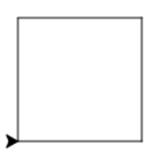

# Les 2a nakijkmodel

## Even opfrissen!

1) 
```python
1. pen.forward(100)
2. pen.left(90)
3. pen.forward(100)
4. pen.left(90)
5. pen.forward(100)
6. pen.left(90)
7. pen.forward(100)
8. pen.left(90)
```

2)
1. in totaal bestaan er 360 graden. Een driehoek heeft drie hoeken, dat is 360/3, dus een hoek van een driehoek is 120 graden. 

2. 120

3. 
```python
1. pen.forward(100)
2. pen.left(120)
3. pen.forward(100)
4. pen.left(120)
5. pen.forward(100)
6. pen.left(120)
```

3)
1. zeshoek

2. 72 graden

3. achthoek

4. 3,6 graden

    <div style="page-break-after: always;"></div>

4)
1. 

```python
1. pen.forward(100)
2. pen.left(120)
3. pen.forward(100)
4. pen.left(120)
5. pen.forward(100)
6. pen.left(120)
```

2.

```python
1. pen.forward(100)
2. pen.left(60)
3. pen.forward(100)
4. pen.left(60)
5. pen.forward(100)
6. pen.left(60)
7. pen.forward(100)
8. pen.left(60)
9. pen.forward(100)
10. pen.left(60)
11. pen.forward(100)
12. pen.left(60)
```

3.
```python
1. pen.forward(100)
2. pen.left(45)
3. pen.forward(100)
4. pen.left(45)
5. pen.forward(100)
6. pen.left(45)
7. pen.forward(100)
8. pen.left(45)
9. pen.forward(100)
10. pen.left(45)
11. pen.forward(100)
12. pen.left(45)
13. pen.forward(100)
14. pen.left(45)
15. pen.forward(100)
16. pen.left(45)
```

 <div style="page-break-after: always;"></div>

### Herhalen met lussen

1)

1. 

2. 

3. 

4. 

5. 

    <div style="page-break-after: always;"></div>

2)

1.  

```python
for i in range(4):
  pen.forward(100)
  pen.left(90)
```

2.  

```python
for i in range(5):
  pen.forward(100)
  pen.left(72)
```

3.  

```python
for i in range(8):
  pen.forward(100)
  pen.left(45)
```

 <div style="page-break-after: always;"></div>

### Extraatje!

1.  

```python
for i in range(3):
  pen.forward(100)
  pen.left(60)
```

2. 

```python
for i in range(3):
  pen.forward(100)
  pen.right(120)
```

3. 

```python
for i in range(3):
  pen.left(120)
  pen.forward(100)
for i in range(4):
  pen.left(90)
  pen.forward(100)
```

4. 

```python
for i in range(4):
  pen.forward(100)
  pen.left(90)
for i in range(4):
  pen.left(90)
  pen.forward(100)
```

5. 

```python
for i in range(10):
  pen.forward(100)
  pen.left(80)
for i in range(3):
  pen.forward(100)
  pen.left(120)
```

