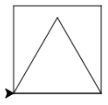

## Module 2: Kunst Les 3 werkblad a nakijkmodel

### Even opfrissen

1) 

1. 

2. 
3. FOUT: de indenting (spaties) op de tweede en derde regel is fout.
4. 
5. 

 <div style="page-break-after: always;"></div>

2)

1. 
```python
for i in range(3):
  pen.forward(100)
  pen.left(120)
```

2. 

```python
for i in range(6):
  pen.forward(100)
  pen.left(60)
```

3. 

```python
for i in range(3):
  pen.forward(100)
  pen.left(60)
```

4. 

```python
for i in range(8):
  pen.forward(100)
  pen.left(45)
```

 <div style="page-break-after: always;"></div>

### Meerdere figuren

1) 

1. 
2. 
3. 
4. 
5. 
6. 


### Extraatje!

1. 

```python
for i in range(4):
  pen.left(90)
  pen.forward(100)

pen.forward(100)

for i in range(3):
  pen.right(90)
  pen.forward(100)
```

2. 

```python
for i in range(4):
  pen.forward(100)
  pen.left(90)

for i in range(3):
  pen.forward(100)
  pen.left(120)

pen.forward(100)
```
 <div style="page-break-after: always;"></div>

3. 

```python
for i in range(4):
  pen.forward(100)
  pen.left(90)

pen.penup()
pen.forward(100)
pen.pendown()

for i in range(4):
  pen.forward(100)
  pen.left(90)
```

4. 

```python
for i in range(9):
  pen.forward(100)
  pen.left(80)

pen.penup()
pen.forward(150)
pen.pendown()

for i in range(9):
  pen.forward(50)
  pen.left(80)
```